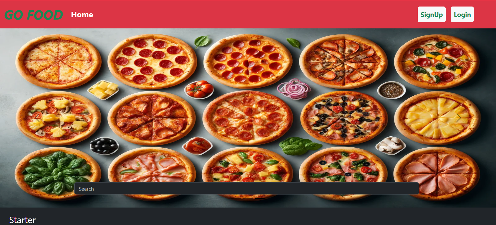
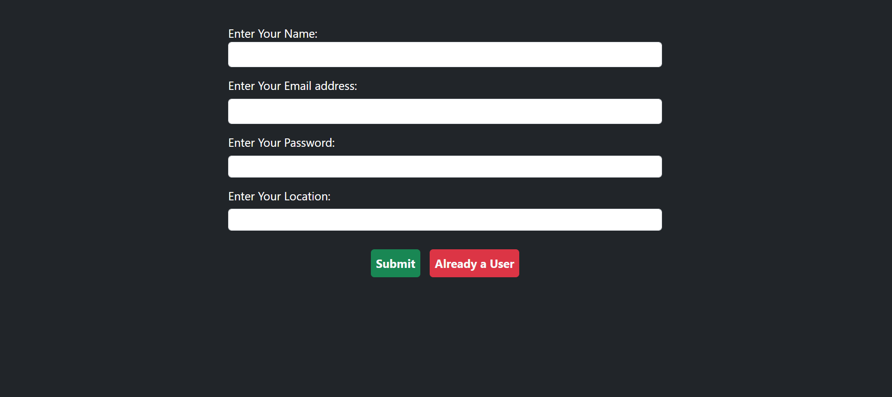
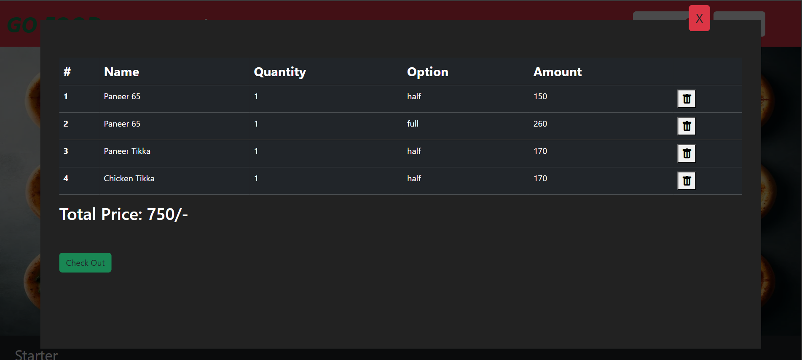

# 🍕 GoFood - MERN Stack Food Ordering App

**GoFood** is a full-stack food ordering web application built using the **MERN stack** (MongoDB, Express.js, React.js, Node.js). It allows users to register, browse meals, manage their cart, and securely place orders — all through a seamless user interface.

---

## 🚀 Features

### 👥 User Features

- Register/Login with JWT authentication
- Browse food categories and items
- Search meals
- Add to cart
- Checkout and place orders
- View past orders

### 🛠️ Admin Features

- Add/Edit/Delete Food Items
- Manage Categories
- View All Orders
- Monitor Customer Activity

---

## 🧪 Tech Stack

- **Frontend**: React.js, Bootstrap/Tailwind CSS
- **Backend**: Node.js, Express.js
- **Database**: MongoDB with Mongoose
- **Authentication**: JWT
- **State Management**: Context API / Redux (if used)
- **Deployment**: Vercel (frontend) & Render/Railway (backend)

---

## 📁 Folder Structure

gofood-mern/
├── backend/
│ ├── controllers/
│ ├── models/
│ ├── routes/
│ ├── middleware/
│ └── server.js
│
├── frontend/
│ ├── components/
│ ├── pages/
│ ├── App.js
│ └── index.js
│
├── .env
├── .gitignore
└── README.md

---

## ⚙️ Setup Instructions

### 🔧 1. Clone the Repository

git clone https://github.com/NikitaSain20/Go-Food-Mern
cd GoFood

### 📦 2. Backend Setup

cd backend  
npm install  
npm run start

### 💻 3. Frontend Setup

cd ../frontend  
npm install  
npm start

## 📸 Screenshots

  
  
   
  
  
  

## 🙋‍♀️ Author

Nikita Sain
Check out my GitHub for more projects: @NikitaSain20
